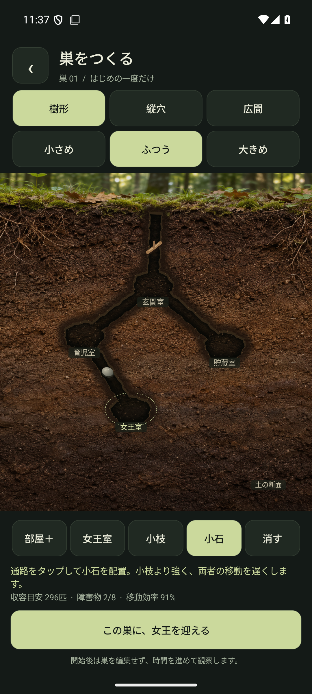
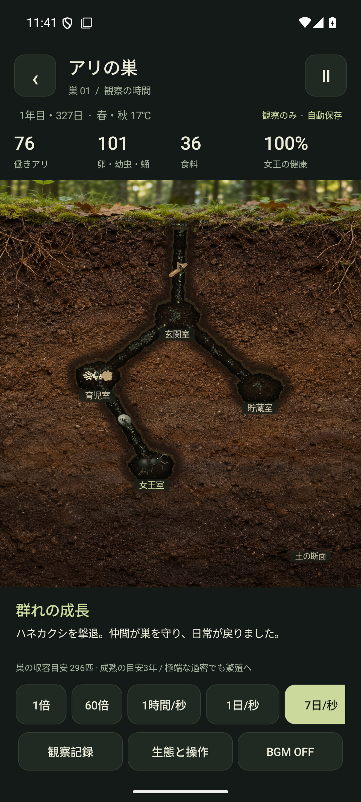
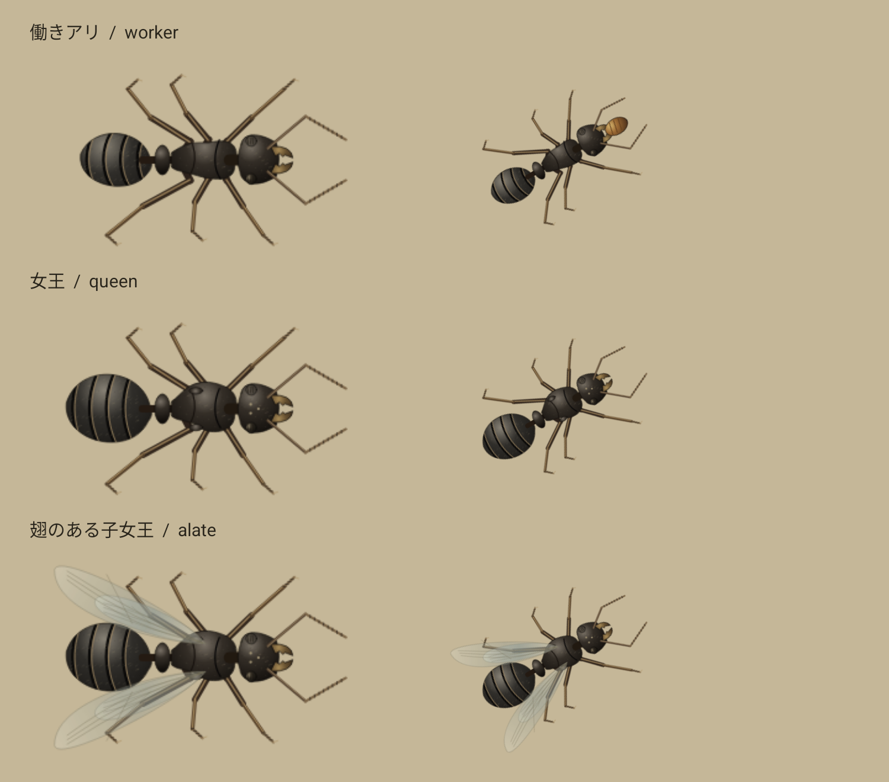
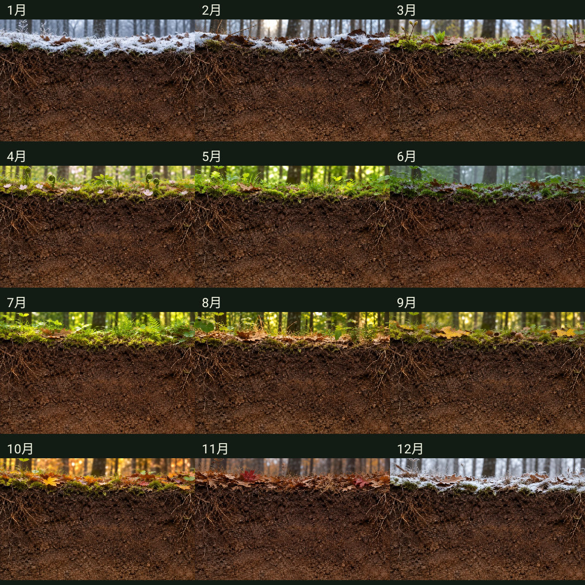
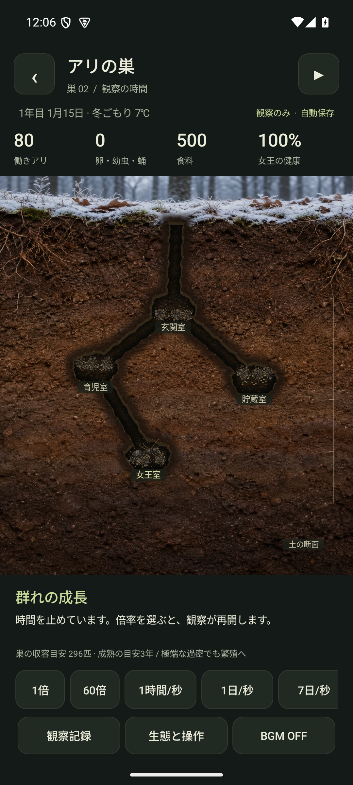

# アリの巣 — ARI

**土の下で、命はつづく。**

巣をつくり、女王を迎え、群れの暮らしを断面から見守るAndroid向け放置観察ゲーム。最初の設計が終わったら、プレイヤーの操作は時間と観察だけです。採餌や巣の拡張、防衛、子女王の育成はアリたちが自動で進めます。

## 遊び方

1. 3つの保存枠から空いている枠を選びます。
2. 樹形・縦穴・広間と、3段階の広さを選びます。土をタップして部屋を増やせます。
3. 女王室を指定し、通路に小枝や小石を置きます。外敵の足止めになりますが、働きアリの移動も遅くなります。
4. 「この巣に、女王を迎える」で開始。女王の到着から、最初の働きアリの羽化、群れの成長を観察します。
5. 1倍・60倍・1時間/秒・1日/秒・7日/秒で時間を進めます。Ⅱで一時停止。入巣・襲撃・旅立ちは最大1時間/秒に自動減速します。
6. 子女王が成長して巣から旅立つとクリア。外敵が女王室に到達して女王が捕食されるか、食料不足で女王が死ぬと終了です。

ピンチで最大6倍まで拡大し、ドラッグで断面を移動できます。部屋のタップで生態・役割を読み、「観察記録」で群れの履歴を確認できます。開始後には巣や戦闘を操作するボタンはありません。

## 実装

- Kotlin / Android Canvasによるネイティブゲーム。Android 8.0以上、target/compile SDK 36。
- 動的な連結グラフから部屋・通路を描画。土の質感、六脚・触角の歩行、発育段階、運搬、侵入虫、翅のある子女王を表示。
- ゲーム内の月に連動する12枚の季節背景。5月1日開始、芽吹き・梅雨・紅葉・雪景色を365日周期で表示。保存データの暦をそのまま使用。
- 関節脚と交互三脚歩行、複眼、大顎、腹柄、腹部の節、微細な毛、2対の翅を描き分けるアリのモデル。歩調は移動距離と障害物に連動。
- 卵→幼虫→蛹→成虫の段階、季節と温度、食料収支、寿命、役割配分、巣の拡張、侵入経路・防衛集合をモデル化。
- 個体群と乱数を含む30分刻みの決定的シミュレーション。3枠のAtomicFile保存。破損データを無断で初期化しません。
- 10秒ごと・終了時に保存。再開時は現実の経過時間で最大30日を計算。早送り倍率を留守中に適用しません。一時停止も保存。
- オリジナルの64秒ループBGM「土の下の午後」。ON/OFFを保存し、バックグラウンドや他の音声への切り替えに対応。
- オフライン動作。広告、課金、ネットワーク権限、分析SDKなし。

## 生態について

特定の種を厳密に再現する研究用モデルではなく、温帯のアリを参考にしたゲームです。発育は日・季節・年単位ですが、具体的な日数・係数・襲撃周期・過密による繁殖は設計値です。参考文献と全係数は [docs/BIOLOGY.md](docs/BIOLOGY.md)、アプリ内の「生態と操作」に記載しています。

「女王の交代」は子女王が新たな巣へ命をつなぐ世代継承として表現しています。母女王は元の巣に残り、子女王が母女王を必ず置き換えるという誤った一般化はしていません。

## ビルド

JDK 17、Android SDK 36、Build Tools 36を用意し、`local.properties` に `sdk.dir=/path/to/Android/Sdk` を指定します。

```sh
./gradlew testDebugUnitTest lintDebug assembleDebug
# 専用エミュレーターを起動した上で
ANDROID_SERIAL=emulator-5554 ./gradlew connectedDebugAndroidTest
# 署名設定がある場合に配布用APKとAABを作成
./gradlew lintRelease assembleRelease bundleRelease
```

デバッグAPK: `app/build/outputs/apk/debug/app-debug.apk`。配布署名の設定は [docs/DELIVERY.md](docs/DELIVERY.md) を参照してください。鍵・パスワード・端末固有SDKパス・APK/AABはGitに含めません。

## 構成

| ファイル | 役割 |
|---|---|
| `Colony.kt` | 巣のグラフ・経路・生態・戦闘・クリア/敗北 |
| `NestView.kt` | 土・通路・虫・障害物・成長・ピンチ/パンの描画 |
| `AntRenderer.kt`, `AntGait.kt` | アリの形態・材質・歩調と方向転換 |
| `SeasonCalendar.kt`, `SeasonalBackground.kt` | 365日の暦と12か月の背景 |
| `MainActivity.kt` | 3枠の一覧・巣づくり・観察・生態解説 |
| `StateCodec.kt`, `SaveStore.kt` | バージョン付き保存・検証・AtomicFile |
| `AmbientMusic.kt` | BGMと音声フォーカス |
| `tools/make_music.py` | オリジナルBGMの再生成（Python標準ライブラリ＋FFmpeg） |

背景アートと生成プロンプトは [docs/ART.md](docs/ART.md)、検証記録は [docs/VALIDATION.md](docs/VALIDATION.md) にまとめています。

## 画面

巣の編集画面と、女王1匹から通常の早送りで成長した群れの観察画面です。

| 巣づくり | 群れの観察 |
|---|---|
|  |  |


### 1.1.0のアリと季節

同じ描画エンジンで出力した形態の比較と、12か月の背景一覧です。上の通常プレイ画面は1.0.0の記録です。




冬の観察画面（検証用の保存状態）:


